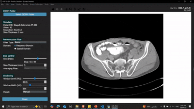

# CT Reconstruction Tool

## Overview

The **CT Reconstruction Tool** is a desktop application built with PyQt5 and Matplotlib for visualizing and processing CT scan data stored in DICOM format. It provides an intuitive interface for radiologists, researchers, and medical professionals to load, reconstruct, and analyze 3D CT volumes with customizable parameters. The app features a user-friendly control panel, a large image display area, and interactive tools to enhance diagnostic workflows.

### Features

- **DICOM File Loading**: Load a folder of DICOM (.dcm) files to create a 3D volume for visualization.
- **Reconstruction Filters**: Apply filters (Ramp, Hann, Hamming) in frequency or spatial domains to reconstruct CT slices.
- **Slice Navigation**: Browse through slices of the 3D volume using a slider, with support for adjustable slice thickness (1–20 mm) and averaging filters (Gaussian, Median).
- **Windowing Controls**:
  - Adjust window level (WL, -1000 to 3000 HU) and window width (WW, 1 to 2000 HU) using sliders or spin boxes.
  - Synchronized controls ensure sliders and spin boxes update together.
  - Presets (e.g., Brain, Lung) for quick windowing adjustments.
- **Large Image Display**:
  - Maximized canvas with minimal white space for clearer visualization of CT slices.
  - Added Matplotlib navigation toolbar with blue-colored icons for zooming, panning, and saving the plot.
- **Export Functionality**: Export all slices as a single tiled PNG image via a right-click context menu.
- **Enhanced Readability**: All text (labels, buttons, etc.) uses a 14 pt font for improved accessibility.
- **Metadata Display**: View patient ID, slice count, resolution, and thickness in the control panel.

## Screenshots and Demos

### Mockup

*Caption: A mockup of the CT Reconstruction Tool interface, showcasing the control panel and image display.*

### GIF Demo


*Caption: A GIF demonstrating slice navigation, windowing adjustments, and export functionality.*

## Installation

### Prerequisites
- Python 3.8 or higher
- PyQt5
- NumPy
- pydicom
- Matplotlib
- SciPy

### Steps
1. **Clone the Repository**:
   ```bash
   git clone https://github.com/Ziyad-HF/CT-Toolkit.git
   cd CT-Toolkit
   ```
   
2. **Create a Virtual Environment** (optional but recommended):
   ```bash
   python -m venv venv
   source venv/bin/activate  # On Windows: venv\Scripts\activate
   ```

3. **Install Dependencies**:
   ```bash
   pip install pyqt5 numpy pydicom matplotlib scipy
   ```

4. **Run the Application**:
   ```bash
   python main.py
   ```

## Usage

1. **Launch the App**:
   - Run the script to open the main window.

2. **Load DICOM Files**:
   - Click "Select DICOM Folder" to choose a directory containing DICOM (.dcm) files.
   - The app loads the files into a 3D volume and displays metadata (patient ID, slice count, resolution, thickness).

3. **Adjust Reconstruction Parameters**:
   - **Filter Type**: Select a reconstruction filter (Ramp, Hann, Hamming) from the dropdown.
   - **Domain**: Choose between frequency domain (simulating FBP) or spatial domain (post-processing) using radio buttons.
   - **Slice Thickness**: Set the thickness (1–30 mm) using the spin box, with an averaging filter (Gaussian, Median) for thicker slices.

4. **Navigate Slices**:
   - Use the "Slice Index" slider to browse through the 3D volume.
   - The current slice index and total slices are displayed (e.g., "Slice: 29 / 100").

5. **Adjust Windowing**:
   - Use the "Window Level (HU)" and "Window Width (HU)" sliders or spin boxes to adjust brightness and contrast.
   - Select a preset (e.g., Brain, Lung) from the dropdown for quick adjustments.

6. **Interact with the Image**:
   - Use the navigation toolbar below the canvas to zoom, pan, or save the current view.
   - Right-click the canvas and select "Export All Slices as Image" to save a tiled PNG of all slices.

7. **Reset Parameters**:
   - Click the "Reset" button to restore default settings (e.g., WL: 40, WW: 400, thickness: 1 mm).

## Code Structure

- **main.py**: The main script containing the `MainWindow` class with all UI and logic.
- **Dependencies**:
  - `PyQt5`: For the GUI framework.
  - `pydicom`: For reading DICOM files.
  - `NumPy` and `SciPy`: For image processing and reconstruction.
  - `Matplotlib`: For rendering the CT slices and navigation toolbar.


### For more details about the methodology and results check the report [here](media/Report.pdf) and the presentation [here](media/Presentation.pptx).